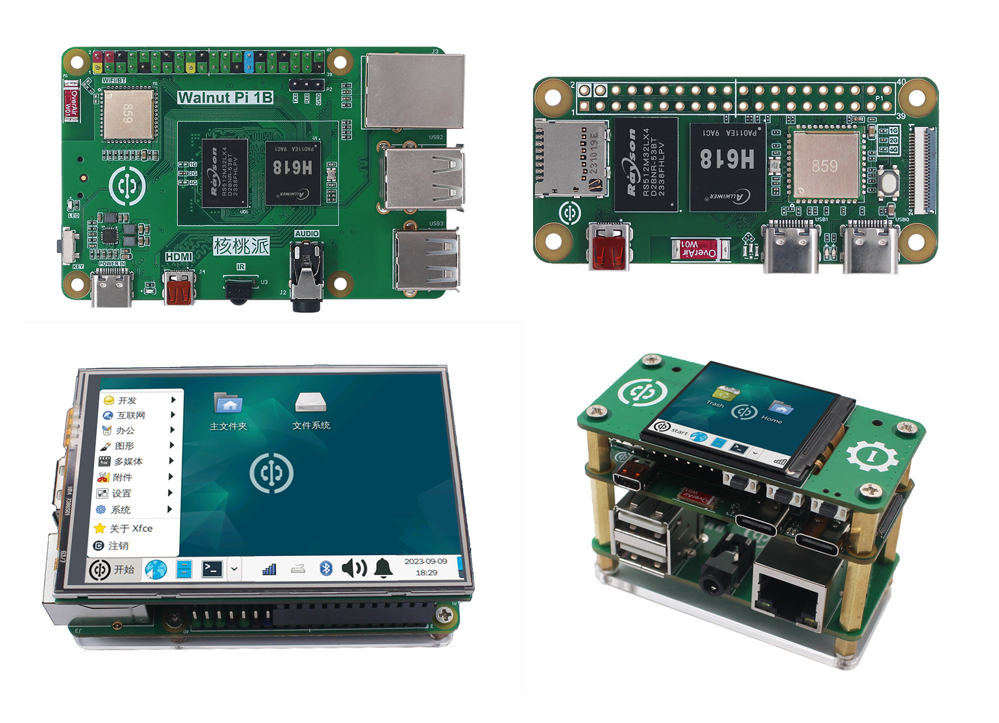

# WalnutPi 1

**English** | [中文](README_zh.md)



## Supported Products

| Product | Processor | Memory | Storage | Wireless | Ethernet | Display | Dimensions | Buy |
|:---:|:---:|:---:|:---:|:---:|:---:|:---:|:---:|:---:|
| [WalnutPi 1B][1] | H618 | 1/2/4GB LPDDR4 | MicroSD | Dual-band WiFi6 + BT5.0 | 100Mbps | HDMI / SPI LCD | 85×56×21mm | [🛒][2] |
| [WalnutPi ZeroW][3] | H618 | 1/2/4GB LPDDR4 | MicroSD | Dual-band WiFi6 + BT5.0 | 100Mbps | HDMI / SPI LCD | 65x30x5mm | [🛒][4] |
| [WalnutPi CM1][5] | H618 | 1/2/4GB LPDDR4 | EMMC/MicroSD | Dual-band WiFi6 + BT5.0 | 100Mbps | HDMI / MSPI LCD | 55x40x4mm | [🛒][6] |

[1]: https://wiki.walnutpi.com/en/docs/walnutpi_1/intro/hw-parameter/#walnutpi-1b
[2]: https://www.aliexpress.com/item/1005006129955506.html

[3]: https://wiki.walnutpi.com/en/docs/walnutpi_1/intro/hw-parameter/#walnutpi-zerow
[4]: https://www.aliexpress.com/item/1005007401281722.html

[5]: https://wiki.walnutpi.com/en/docs/walnutpi_1/intro/hw-parameter/#walnutpi-cm1
[6]: https://www.aliexpress.com/item/1005007653683565.html

## Repository Structure

```
walnutpi-1/
├── examples/          # Example code (grouped by function)
│   ├── 01_python_embedded/ # Python embedded
│   ├── 02_opencv/      # Machine vision
│   ├── 03_pyqt5/       # Graphical display
├── hardware/          # Hardware design files (schematics, footprints, 3D models)
├── CHANGELOG.md       # Changelog
├── LICENSE
├── README.md          # English documentation
└── README_zh.md       # Chinese documentation
```

## Quick Start

1. Download the latest image from the repository [Releases](https://github.com/walnutpi/walnutpi-1/releases) page;
2. Image flashing tutorial: https://wiki.walnutpi.com/en/docs/walnutpi_1/getting_start/os-install

## Development Resources

- [Wiki (tutorial documentation)](https://wiki.walnutpi.com/en/docs/walnutpi_1)

## Changelog

See [CHANGELOG.md](CHANGELOG.md).

## Technical Support

If you encounter any issues, you can get support through the following channels:

1. **GitHub Discussions**: Ask questions and communicate in [WalnutPi-1 Discussions](https://github.com/walnutpi/walnutpi-1/discussions);
2. **Email**: Send an email to [walnutpi@qq.com](mailto:walnutpi@qq.com).
